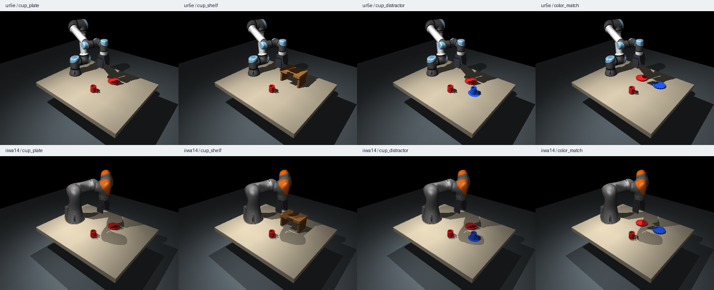

# Physical AI — финальный проект

**Приватный комплект организаторов.** Содержит студенческую основу и закрытые
материалы проверки. Не выдавайте студентам доступ к этому репозиторию или его
истории: экспортируйте отдельную студенческую поставку.



- [Задание](ASSIGNMENT.md): 8 RL-политик, данные, BC, абляции, робастность.
- [Быстрый старт](reviewer/STUDENT_README.md): установка и команды.
- [Краткий MuJoCo](MUJOCO_GUIDE.md).
- [Руководство проверяющего](reviewer/README.md).
- [Фактическая валидация и ограничения](reviewer/VALIDATION.md).

```bash
python3.12 -m venv .venv
source .venv/bin/activate
pip install torch==2.7.1 --index-url https://download.pytorch.org/whl/cpu
pip install -r requirements-lock.txt
MUJOCO_GL=osmesa python -m pytest -q
python -m reviewer.export_students dist/physical-ai-student --zip
```

Системные библиотеки и Docker описаны в быстром старте. Экспорт использует явный
список разрешённых файлов. В архиве нет `reviewer/`, `.git`, внутренних планов и
проверок закрытых сценариев. README заменяется студенческой инструкцией.
Для публикации студенческой версии создавайте новую git-историю **из экспорта**,
а не ветку/форк этого приватного репозитория.

Код нового проекта — MIT; модели Menagerie — BSD-3-Clause. Ревизии и источники
сохранены в `THIRD_PARTY_NOTICES.md` и `assets/MENAGERIE_REVISION`.
